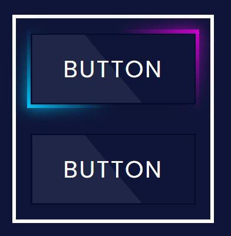

# BG-Glowing-Button

This is a design of the BG-Glowing-Button Animation on hover effect.

## Table of contents

- [Overview](#overview)
  - [The challenge](#the-challenge)
  - [Screenshot](#screenshot)
  - [Links](#links)
- [My process](#my-process)
  - [Built with](#built-with)
  - [What I learned](#what-i-learned)
- [Author](#author)

## Overview

### The challenge

Users should be able to:

- View the optimal animation on hovering your mouse to the card
- See hover states for all interactive elements on the page

### Screenshot



### Links

- Solution URL: [Github](https://github.com/zaidansari42/BG-Glowing-Button/)
- Live Site URL: [Live Website](https://zaidansari42.github.io/BG-Glowing-Button/)

## My process

### Built with

- Semantic HTML5 markup
- CSS custom properties
- Flexbox

### What I learned

I learned how to create a beautiful button with only HTML & CSS.

```html
<div class="container">
  <a href="#">
    <span>Button</span>
  </a>
</div>
```

```css
.container a:nth-child(1):before,
.container a:nth-child(1):after {
  background: linear-gradient(45deg, #00ccff, #0e1538, #0e1538, #d400d4);
}
.container a:nth-child(2):before,
.container a:nth-child(2):after {
  background: linear-gradient(45deg, #00ccff, #0e1538, #0e1538, #1aff22);
```

## Author

- Website - [Zaid Ansari](https://github.com/zaidansari42/)
- Twitter - [@zaidnasari42](https://www.twitter.com/zaidnasari42)
